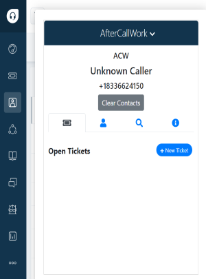
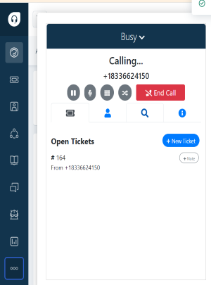
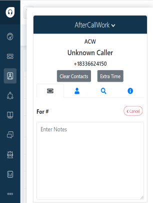

# Open Ticket Tab

#### It is used to create a new ticket/view any assigned open tickets for the caller.

 - Create a new ticket.

    

 - If an existing customer calls,the assigned open tickets will be listed out.

    

 - Extra time-> A agent get 15seconds of time, can make a note of customer queries, based on the configuration the screen saves and closes automatically, if the agent wants extra time ACW can be activated so the agents gets some extra time .

    

