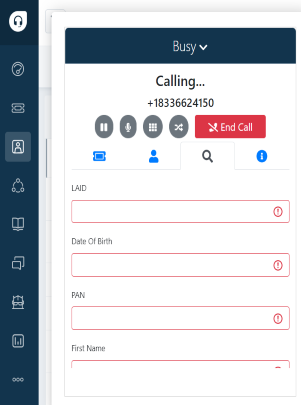
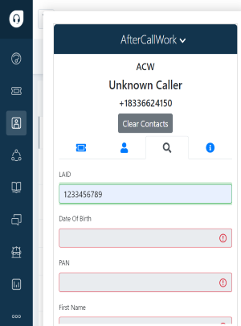
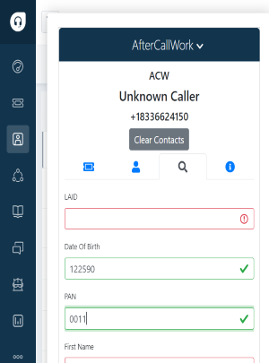
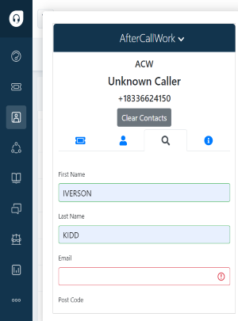
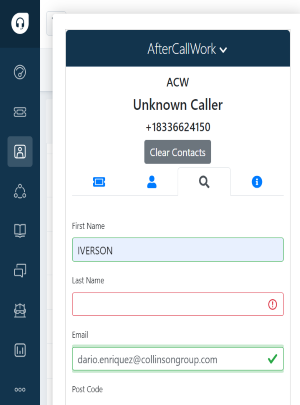
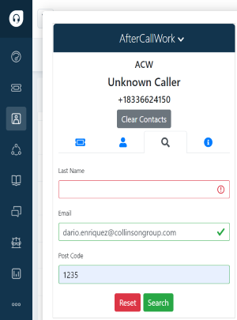

# Search Tab

<!--  -->

<!-- # Overview
   Search -> Search a customer detail with LAID,Date Of Birth,PAN,First name,Last name,Email,Postal Code. -->

- Search by LAID-LAId being unique number customers can be searched by this parameter.
<!-- - Search either with DOB,PAN,First Name,Last Name,Email and Postal Code -->
- If LAID not available, manual search can be accomplished with any two following parameter(DOB,PAN,First Name,Last Name,Email,Postal Code)

 - Search Tab

  

<!--  -->

<!-- - Agents can use LAID to search customer details (only LAID) -->
<!-- 

- Agents can use Date Of Birth and PAN (except LAID)

 -->

<!-- - Agents can use First name and Last name (except LAID)

- Agents can use First name and Email (except LAID)

- Agents can use Email and PostCode (except LAID)

 -->

<!--  -->