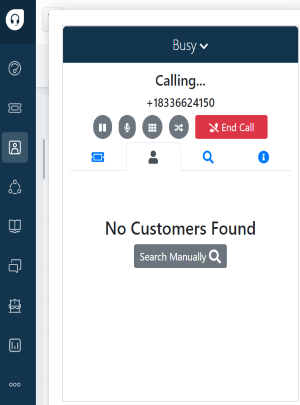

# Customer Tab

<!-- # Overview 
 It have customer informations and also have the view button that
  redirect to the details tab -->
<!-- # Description -->

  <!--  -->
  - Displays customer information (First name, Last name, Postal code, View)

    

  - <b> View button </b> redirect to the details tab with more information (DOB,PAN,Card Tier,Card Status,Point Balance,PCH,SCH)
  - When a customer calls they manually enter vaild <b> DOB and PAN </b>,if multiple customer exists, this screen list outs all the customer information, by clicking <b> VIEW </b> seeing all details, get the exact customer.
  

<!-- 
  - Customer details tab -->

  
  
  <!-- - If no details found Agents can search customer details manually
 
   
 -->
